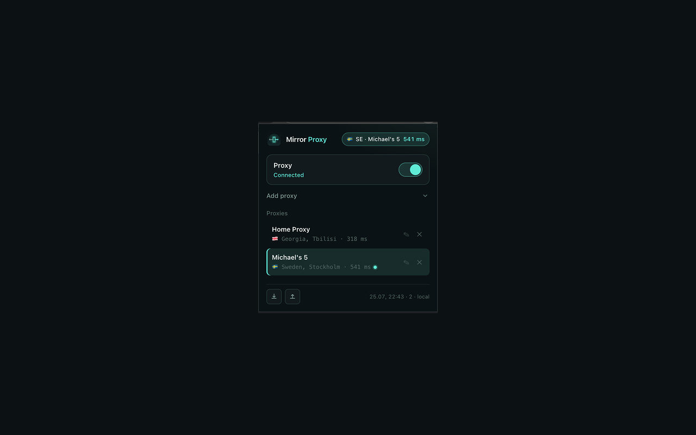
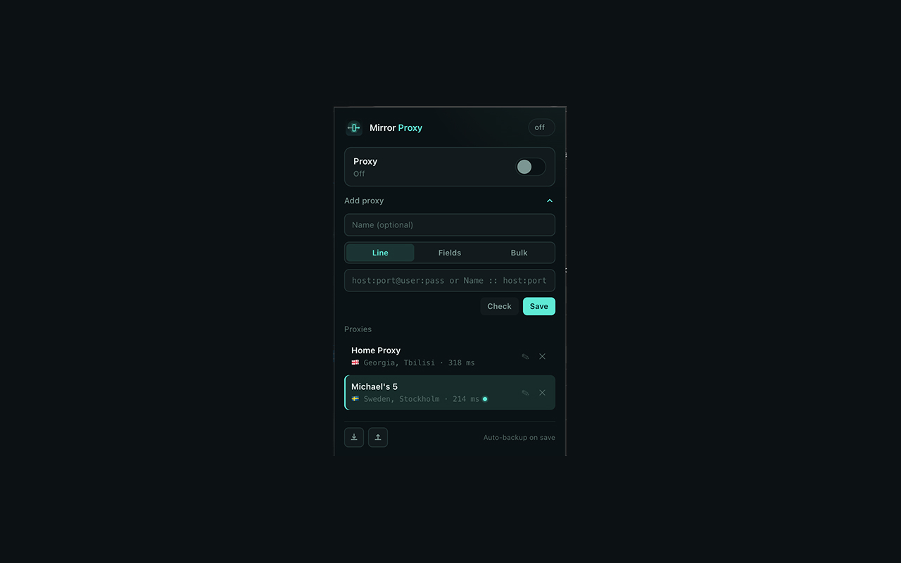
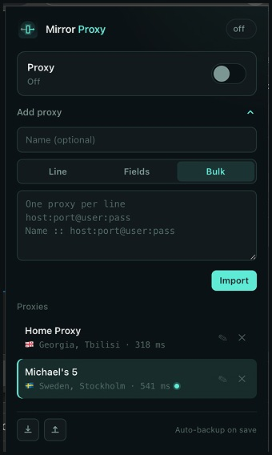

# Mirror Proxy

[](https://github.com/jehkinen/mirror-proxy/releases)

Browser-only HTTP proxy switcher for Chrome. Save proxies, name them, switch with one click, and verify exit IP, country, and ping — without touching system VPN or macOS network settings.

---

## Screenshots

### Connected

<p align="center">
  
</p>

Status chip with flag, name (or IP), and ping. Enable switch and named proxy list.

### Add proxy

<p align="center">
  
</p>

Optional name, Line / Fields / Bulk input, Check and Save.

### Bulk import

<p align="center">
  
</p>

Paste many proxies at once — one per line, optional `Name :: proxy` prefix.

---

## Features

- **Chrome-only proxy** via `chrome.proxy` — does not affect system proxy, Clash, or other apps
- **Proxy list** with optional display names
- **Line / Fields / Bulk** add modes
- **Check** exit IP, country, and latency before or after saving
- **Enable / disable** with a switch
- **Rename** proxies inline (pencil or double-click)
- **Export / import** JSON backup + auto-backup on save
- Supports common proxy string formats (Proxy.Market and others)

---

## Install (unpacked)

1. Open Chrome → `chrome://extensions`
2. Turn on **Developer mode**
3. **Load unpacked** → select this folder
4. Paste a proxy → **Save** → select it in the list → turn **Proxy** on

---

## Proxy formats

```
host:port@user:pass
user:pass@host:port
host:port:user:pass
user:pass:host:port
host:port
Name :: host:port@user:pass
```

Also: `http://…`, `socks5://…` (scheme stripped; applied as HTTP proxy), IPv6, and bulk delimiters. Lines starting with `#` are ignored in bulk import.

---

## Privacy

- Credentials and settings stay in `chrome.storage` on your device (optional Chrome sync backup when small enough)
- Connection checks call **ipify** and **ipwho.is** from your browser
- No analytics and no data sent to the developer’s servers

Full policy: https://andydev.space/mirror-proxy/privacy/

---

## License / notes

Mirror Proxy does **not** provide proxy servers. You use your own credentials from any HTTP proxy provider.
